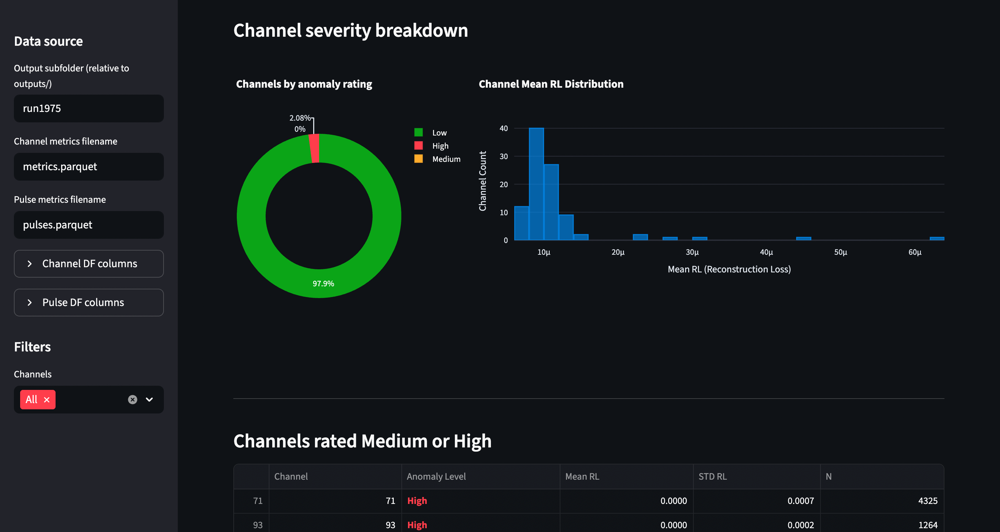

# Milliqan Anomaly Detection Pipeline

Author: Saloni Shah

## Overview

This repository implements an end-to-end anomaly detection pipeline for the **Milliqan experiment** at CERN. The Milliqan detector records pulse-level signals across many channels. Detector issues or noise bursts can cause abnormal pulse behavior that may not be immediately visible through standard monitoring tools.

The system analyzes pulse-level detector data and provides automated anomaly detection to identify problematic detector channels early and assist with detector diagnostics.

<a href="https://www.youtube.com/watch?v=VIDEO_ID](https://www.youtube.com/watch?v=rFjgGTclM9E">
  
</a>

---

## Data
Typical run size:  19 million pulses    
Channels monitored: 96

## Pipeline

The workflow is:

Run Data → Preprocessing → Feature Engineering → Scaling
→ Conditional Autoencoder → Reconstruction Loss
→ Channel Metrics → Anomaly Rating → Output Files → Dashboard


Steps performed:

1. Load detector run data
2. Apply detector quality cuts and preprocessing
3. Engineer and transform features
4. Normalize features using a saved scaler
5. Run inference using a trained conditional autoencoder
6. Compute reconstruction loss for each pulse
7. Aggregate anomaly statistics by detector channel
8. Assign anomaly severity ratings
9. Export pulse-level and channel-level outputs
10. Visualize results in the Streamlit monitoring dashboard

---

## Model

The anomaly detector is a **conditional autoencoder** implemented in TensorFlow/Keras.  
The model reconstructs pulse features while conditioning on the detector **channel ID** using a learned embedding allowing the model to learn channel-specific signal distributions while sharing statistical strength across channels.

### Encoder

Input features + channel embedding  
→ Dense(64)  
→ Dense(32)  
→ Latent representation (16)

### Decoder

Latent + channel embedding  
→ Dense(32)  
→ Dense(64)  
→ Output reconstruction

Key details:

- Channel embedding dimension: **13**
- Loss: **Mean Squared Error**
- Optimizer: **Adam**
- Gaussian input noise for regularization
- L2 weight decay
- Early stopping during training

---

## Anomaly Scoring

For each pulse, anomaly score is computed as the reconstruction error:
```
score = mean((x - x_reconstructed)^2)
```


Channel-specific thresholds are learned from the training set using the **99.5th percentile** of reconstruction error.

For each channel the pipeline computes:

- mean reconstruction error
- standard deviation of reconstruction error
- number of anomalous pulses
- fraction of anomalous pulses

Channels are assigned severity ratings:

| Fraction of Anomalous Pulses | Rating |
|-------------------------------|--------|
| < 1% | Low |
| ≥ 1% | Medium |
| ≥ 3% | High |

---

## Automation

The anomaly detection pipeline can run automatically on new detector runs.

A scheduled script: run_daily.sh

The script:
1. Reads the last processed run from a state file
2. Queries the Milliqan run directory for the latest available run 
3. Skips execution if no new run is available 
4. Constructs the pulse data URL for the new run 
5. Executes the anomaly detection pipeline 
6. Saves outputs under a run-specific output directory 
7. Writes logs for monitoring and debugging 
8. Updates the saved pipeline state 

The pipeline is run **once per day** on cms18.

---

## Dashboard

Results are visualized using a **Streamlit dashboard** that displays:

- channel anomaly ratings
- reconstruction loss distributions
- anomalous pulse fractions
- run-level detector diagnostics

SSH tunneling steps for the dashboard: 

    1. ssh -L 8501:127.0.0.1:8501 username@cms18
    2. Open url: http://localhost:8501
    
Example Streamlit monitoring dashboard used to visualize anomaly statistics.



## Repository Structure

artifacts/    saved scalers and thresholds     
dashboard/    Streamlit monitoring app     
data/         training data      
logs/         pipeline execution logs     
models/       trained autoencoder models      
outputs/      run-level anomaly results     
scripts/      preprocessing, training, and inference scripts     
run_daily.sh  automated pipeline runner  


## Running the Pipeline Manually 

Manual execution is only required for testing or debugging.

Install dependencies:

pip install -r requirements.txt

Run the anomaly detection pipeline:

python scripts/anomalyDetector.py   
--url <RUN_DATA_URL>   
--outputFile outputs/metrics.parquet    
--pulse_output outputs/pulses.parquet   
--model_path models/cond_autoencoder.keras   

Launch the dashboard:

streamlit run dashboard/app.py

## Note

This repository is designed primarily for internal lab use. Its purpose is to document the structure and logic of the anomaly detection pipeline used in the Milliqan experiment.

Large datasets, trained model artifacts, and environment-specific resources are not included in the repository.
